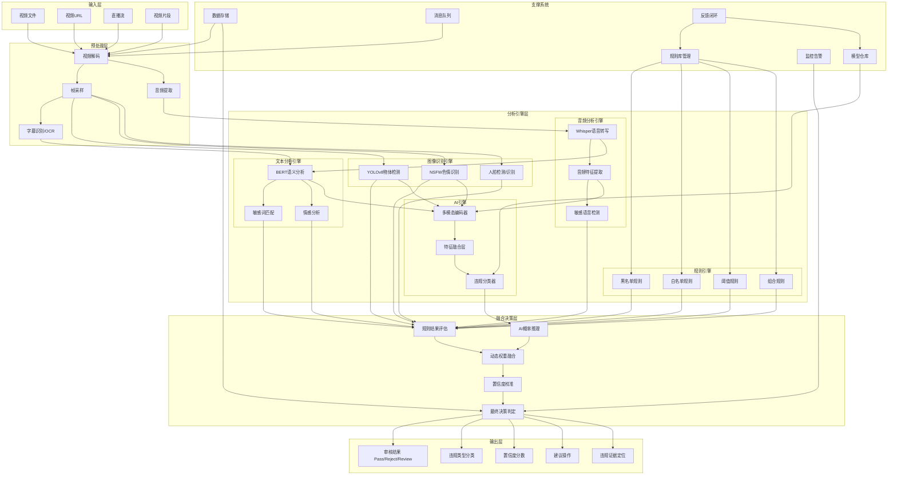
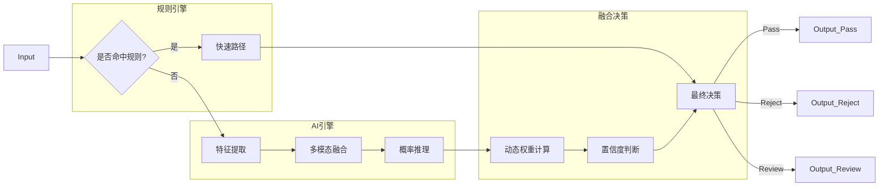

# 视频违规审核 Agent —— 规则+AI 双引擎架构方案

## 一、架构设计核心思想

**"规则+AI"双引擎架构**的核心在于将**确定性规则**与**概率性AI**相结合，兼顾审核的**准确性**和**灵活性**：

```
┌─────────────────────────────────────────────────────────────────────┐
│                    "规则+AI"双引擎架构                              │
├─────────────────────────────────────────────────────────────────────┤
│                                                                     │
│  ┌──────────────┐         ┌──────────────┐         ┌────────────┐  │
│  │   规则引擎    │◄───────►│   融合决策层  │◄───────►│   AI引擎   │  │
│  │  (Rule Engine)│         │ (Fusion Layer)│         │ (AI Engine)│  │
│  │  确定性判断   │         │  加权/投票    │         │  概率推理  │  │
│  └───────┬──────┘         └───────┬──────┘         └──────┬─────┘  │
│          │                        │                        │        │
│          ▼                        ▼                        ▼        │
│  ┌──────────────┐         ┌──────────────┐         ┌────────────┐  │
│  │   规则库      │         │   决策日志    │         │  AI模型库   │  │
│  │  (Rule Base) │         │  (Log Store) │         │ (Model Hub)│  │
│  └──────────────┘         └──────────────┘         └────────────┘  │
│                                                                     │
└─────────────────────────────────────────────────────────────────────┘
```

**设计原则**：
- **规则先行**：明确的违规模式用规则快速判定
- **AI兜底**：模糊场景由AI进行概率推理
- **优势互补**：规则保证精确性，AI保证覆盖性
- **动态协作**：根据置信度动态选择决策路径

---

## 二、完整架构设计



```
┌─────────────────────────────────────────────────────────────┐
│                    混合架构方案                             │
├─────────────────────────────────────────────────────────────┤
│                                                             │
│  ┌──────────────┐    ┌──────────────┐    ┌──────────────┐  │
│  │ 专用图像引擎 │    │ 专用音频引擎 │    │ 专用文本引擎 │  │
│  │  (YOLOv8)    │    │  (Whisper)   │    │  (BERT)      │  │
│  └──────┬───────┘    └──────┬───────┘    └──────┬───────┘  │
│         │                   │                   │           │
│         └─────────┬─────────┴─────────┬─────────┘           │
│                   ▼                   ▼                     │
│           ┌──────────────┐    ┌──────────────┐              │
│           │   规则引擎    │    │  Qwen3.5    │              │
│           │  (精确判定)   │    │  Omni       │              │
│           └──────┬───────┘    │  (模糊推理)  │              │
│                  │            └──────┬───────┘              │
│                  └─────────┬────────┘                      │
│                            ▼                               │
│                   ┌──────────────┐                         │
│                   │  融合决策层  │                         │
│                   └──────────────┘                         │
└─────────────────────────────────────────────────────────────┘
```

---

## 三、各层级详细设计

### 3.1 输入层

| 输入类型 | 描述 | 支持格式/协议 |
|----------|------|---------------|
| 视频文件 | 本地文件上传 | MP4, AVI, MOV, FLV |
| 视频URL | 远程视频链接 | HTTP/HTTPS URL |
| 直播流 | 实时直播内容 | RTMP, HLS, WebRTC |
| 视频片段 | 指定时间范围 | 时间戳区间 |

### 3.2 预处理层

| 子模块 | 功能说明 | 技术实现 |
|--------|----------|----------|
| 视频解码 | 将视频文件解码为帧序列 | FFmpeg + OpenCV |
| 帧采样 | 按时间间隔抽取关键帧 | 均匀采样 + 场景变化检测 |
| 音频提取 | 提取音频轨道 | PCM格式转换 |
| 字幕识别 | 提取视频中的文字信息 | OCR技术 |

**帧采样策略**：
- 常规视频：每2秒采样1帧
- 短视频（<1分钟）：每1秒采样1帧
- 直播流：实时帧处理，设置滑动窗口

### 3.3 规则引擎（Rule Engine）

**核心职责**：处理具有明确模式的违规内容，提供确定性判断

#### 规则分类体系

| 规则类型 | 描述 | 示例 |
|----------|------|------|
| **黑名单规则** | 明确禁止的内容模式 | 敏感人物、违禁物品、固定敏感词 |
| **白名单规则** | 明确允许的内容模式 | 认证媒体、官方账号、合规素材 |
| **阈值规则** | 基于数值阈值的判定 | 画面暴露比例>30%、敏感词出现次数>5次 |
| **组合规则** | 多条件逻辑组合 | 画面暴露+性暗示动作+敏感字幕同时满足 |

#### 规则引擎核心组件

```python
class RuleEngine:
    def __init__(self):
        self.blacklist = BlacklistMatcher()
        self.whitelist = WhitelistMatcher()
        self.threshold_rules = ThresholdEvaluator()
        self.composite_rules = CompositeRuleEvaluator()
    
    def evaluate(self, video_features):
        """规则引擎主入口"""
        # 1. 快速路径：白名单直接通过
        if self.whitelist.match(video_features):
            return {"decision": "pass", "rule_id": "whitelist_match"}
        
        # 2. 快速路径：黑名单直接拒绝
        blacklist_result = self.blacklist.match(video_features)
        if blacklist_result:
            return {"decision": "reject", "rule_id": blacklist_result}
        
        # 3. 阈值规则评估
        threshold_result = self.threshold_rules.evaluate(video_features)
        if threshold_result:
            return {"decision": threshold_result["decision"], "rule_id": threshold_result["rule_id"]}
        
        # 4. 组合规则评估
        composite_result = self.composite_rules.evaluate(video_features)
        if composite_result:
            return {"decision": composite_result["decision"], "rule_id": composite_result["rule_id"]}
        
        # 5. 规则无法判定，交给AI引擎
        return {"decision": "pending", "rule_id": None}
```

#### 规则配置示例

```yaml
# rules.yaml 规则配置文件
rules:
  blacklist:
    - id: "BL001"
      name: "敏感人物识别"
      type: "face_matching"
      targets: ["politically_sensitive_person_1", "politically_sensitive_person_2"]
      action: "reject"
    
    - id: "BL002"
      name: "违禁物品识别"
      type: "object_detection"
      targets: ["weapon", "drug", "gambling_device"]
      action: "reject"
    
    - id: "BL003"
      name: "固定敏感词"
      type: "keyword_exact_match"
      targets: ["敏感词1", "敏感词2", "敏感词3"]
      action: "reject"
  
  threshold_rules:
    - id: "TH001"
      name: "画面暴露度超标"
      condition: "visual.exposure_ratio > 0.3"
      action: "reject"
    
    - id: "TH002"
      name: "敏感词高频出现"
      condition: "text.sensitive_word_count > 5"
      action: "reject"
  
  composite_rules:
    - id: "CO001"
      name: "疑似色情内容"
      conditions:
        - "visual.exposure_ratio > 0.2"
        - "visual.sexual_posture_score > 0.7"
        - "audio.sexual_suggestion_score > 0.6"
      logic: "AND"
      action: "reject"
```

### 3.4 AI引擎（AI Engine）

**核心职责**：处理模糊、复杂、需要语义理解的场景，提供概率性推理

#### AI引擎架构

```
输入特征 → 多模态编码器 → 特征融合 → 分类器 → 概率输出
              ↓              ↓
         图像编码器      音频编码器      文本编码器
         (ViT/ResNet)   (Wav2Vec)      (BERT)
```

#### AI引擎核心组件

```python
class AIEngine:
    def __init__(self):
        self.image_encoder = ImageEncoder()
        self.audio_encoder = AudioEncoder()
        self.text_encoder = TextEncoder()
        self.fusion_module = MultimodalFusion()
        self.classifier = ViolationClassifier()
    
    def predict(self, video_features):
        """AI引擎主入口"""
        # 1. 多模态特征提取
        image_feat = self.image_encoder.encode(video_features["frames"])
        audio_feat = self.audio_encoder.encode(video_features["audio"])
        text_feat = self.text_encoder.encode(video_features["text"])
        
        # 2. 特征融合
        fused_feat = self.fusion_module.fuse([image_feat, audio_feat, text_feat])
        
        # 3. 分类预测
        logits = self.classifier(fused_feat)
        probabilities = torch.softmax(logits, dim=-1)
        
        # 4. 提取各类别置信度
        result = {
            "porn_prob": probabilities[0].item(),
            "violence_prob": probabilities[1].item(),
            "political_prob": probabilities[2].item(),
            "ad_prob": probabilities[3].item(),
            "safe_prob": probabilities[4].item()
        }
        
        return result
```

#### AI模型选型

| 模态 | 模型选择 | 用途 |
|------|----------|------|
| **图像** | ViT/ResNet + YOLOv8 | 帧级特征提取+物体检测 |
| **音频** | Whisper + Wav2Vec | 语音转写+音频特征 |
| **文本** | BERT/RoBERTa | 语义理解+情感分析 |
| **融合** | Transformer Cross-Attention | 多模态特征融合 |

### 3.5 融合决策层（Fusion Layer）

**核心职责**：协调规则引擎与AI引擎，输出最终决策

#### 决策融合策略

```python
class FusionLayer:
    def __init__(self):
        self.rule_engine = RuleEngine()
        self.ai_engine = AIEngine()
        self.confidence_threshold = 0.85  # AI高置信度阈值
        self.review_threshold = 0.7       # 人工复核阈值
    
    def process(self, video_data):
        """融合决策主流程"""
        # 1. 预处理提取特征
        features = self.preprocess(video_data)
        
        # 2. 规则引擎优先判断
        rule_result = self.rule_engine.evaluate(features)
        
        if rule_result["decision"] != "pending":
            return self._build_output(
                decision=rule_result["decision"],
                source="rule",
                rule_id=rule_result["rule_id"],
                confidence=1.0
            )
        
        # 3. 规则无法判定，调用AI引擎
        ai_result = self.ai_engine.predict(features)
        
        # 4. AI结果决策
        max_prob = max(ai_result.values())
        max_category = max(ai_result, key=ai_result.get)
        
        if max_prob >= self.confidence_threshold and max_category != "safe":
            return self._build_output(
                decision="reject",
                source="ai",
                category=max_category,
                confidence=max_prob
            )
        elif max_prob >= self.review_threshold:
            return self._build_output(
                decision="review",
                source="ai",
                category=max_category,
                confidence=max_prob
            )
        else:
            return self._build_output(
                decision="pass",
                source="ai",
                category="safe",
                confidence=ai_result["safe_prob"]
            )
```

#### 决策流程图



### 3.6 输出层

| 输出项 | 描述 | 格式 |
|--------|------|------|
| 审核结果 | 三态判定 | Pass/Reject/Review |
| 违规类型 | 详细分类 | 色情/暴力/政治/广告/版权 |
| 置信度分数 | 概率值 | 0-1区间 |
| 建议操作 | 处理建议 | 自动拒绝/人工复核/通过 |
| 违规证据定位 | 具体证据位置 | 时间戳、模态类型、证据描述 |

### 3.7 支撑系统

| 模块 | 功能 | 技术选型 |
|------|------|----------|
| 规则库管理 | 可视化规则配置、版本控制 | 自定义DSL + PostgreSQL |
| 模型仓库 | 模型版本管理、A/B测试支持 | MLflow / Hugging Face Hub |
| 数据存储 | 审核记录、特征数据、反馈数据 | PostgreSQL + Redis |
| 消息队列 | 异步处理、流量削峰 | Kafka |
| 监控告警 | 全链路追踪、实时监控大屏 | Prometheus + Grafana |
| 反馈闭环 | 人工复核结果回流、模型迭代优化 | 自定义反馈系统 |

---

## 四、双引擎协作机制

### 4.1 动态权重调整

根据历史数据动态调整规则与AI的决策权重：

```python
class DynamicWeighter:
    def __init__(self):
        self.rule_weight = 0.6
        self.ai_weight = 0.4
        self.feedback_store = FeedbackStore()
    
    def update_weights(self):
        """根据反馈数据更新权重"""
        feedbacks = self.feedback_store.get_recent_feedbacks()
        
        # 计算规则引擎和AI引擎的准确率
        rule_accuracy = self._calculate_accuracy(feedbacks, "rule")
        ai_accuracy = self._calculate_accuracy(feedbacks, "ai")
        
        # 动态调整权重（基于准确率）
        total = rule_accuracy + ai_accuracy
        self.rule_weight = rule_accuracy / total
        self.ai_weight = ai_accuracy / total
```

### 4.2 规则挖掘与AI训练闭环

```
用户反馈 → 数据分析 → 规则挖掘 → 规则更新
                              ↓
                         AI模型再训练
                              ↓
                         效果评估
                              ↓
                         部署上线
```

---

## 五、技术选型与部署

### 5.1 技术栈

| 模块 | 技术方案 | 版本 |
|------|----------|------|
| 语言 | Python | 3.10+ |
| 框架 | FastAPI | 0.100+ |
| 规则引擎 | Python Rules Engine | - |
| 图像处理 | OpenCV + YOLOv8 | 8.0+ |
| 音频处理 | Whisper + Librosa | - |
| 文本处理 | BERT/RoBERTa | - |
| 数据库 | PostgreSQL + Redis | 15+ / 7+ |
| 消息队列 | Kafka | 3.5+ |
| 部署 | Docker + Kubernetes | - |

### 5.2 部署架构

```
┌─────────────────────────────────────────────────────────────────┐
│                        Kubernetes集群                            │
├─────────────────────────────────────────────────────────────────┤
│                                                                 │
│  ┌─────────────┐    ┌─────────────┐    ┌──────────────────┐   │
│  │  API Gateway│    │  Rule Engine│    │    AI Engine     │   │
│  │  (Ingress)  │    │  (Pod × 3)  │    │  (GPU Pod × 5)   │   │
│  └──────┬──────┘    └──────┬──────┘    └────────┬─────────┘   │
│         │                  │                     │             │
│         ▼                  ▼                     ▼             │
│  ┌─────────────────────────────────────────────────────────┐   │
│  │                     共享存储层                          │   │
│  │  PostgreSQL (主从)    Redis (集群)    Kafka (3节点)     │   │
│  └─────────────────────────────────────────────────────────┘   │
│                                                                 │
└─────────────────────────────────────────────────────────────────┘
```

---

## 六、关键优势与价值

| 维度 | 规则引擎优势 | AI引擎优势 | 双引擎协同优势 |
|------|--------------|------------|----------------|
| **准确性** | 确定性判断，零误判 | 概率推理，覆盖模糊场景 | 结合两者，兼顾精确与覆盖 |
| **可解释性** | 规则透明，易于审计 | 黑盒模型，难以解释 | 规则提供解释，AI提供覆盖 |
| **灵活性** | 规则更新繁琐 | 模型自适应能力强 | 快速规则调整+模型迭代 |
| **性能** | 低延迟，高吞吐 | 高延迟，资源密集 | 根据场景动态选择 |
| **成本** | 规则维护成本低 | 训练推理成本高 | 平衡成本与效果 |

---

## 七、落地建议

### 7.1 分阶段实施

| 阶段 | 目标 | 重点工作 | 时间 |
|------|------|----------|------|
| **Phase 1** | 规则引擎上线 | 建立基础规则库，实现快速路径 | 2-3周 |
| **Phase 2** | AI引擎上线 | 部署预训练模型，实现模糊场景处理 | 3-4周 |
| **Phase 3** | 双引擎融合 | 实现融合决策层，建立反馈闭环 | 2-3周 |
| **Phase 4** | 优化迭代 | 动态权重调整，规则挖掘，模型迭代 | 持续 |

### 7.2 关键成功因素

1. **规则库建设**：建立完善的规则体系，持续维护更新
2. **数据积累**：收集高质量标注数据，支撑AI训练
3. **反馈闭环**：建立人工复核机制，数据回流优化模型
4. **可观测性**：全链路监控，及时发现问题

---

## 八、监控与可观测性

### 8.1 关键指标

| 指标类型 | 具体指标 | 监控目标 |
|----------|----------|----------|
| **性能指标** | 审核延迟、QPS、吞吐量 | 系统负载评估 |
| **质量指标** | 准确率、召回率、F1分数 | 模型效果监控 |
| **业务指标** | 违规率、人工复核率、误判率 | 业务健康度 |

### 8.2 日志与追踪

- **结构化日志**：JSON格式，包含请求ID、处理时间、结果
- **分布式追踪**：OpenTelemetry + Jaeger
- **异常告警**：Prometheus + Grafana + Alertmanager

---

## 九、安全性与合规性

### 9.1 数据安全
- 视频文件加密存储（AES-256）
- 传输加密（TLS 1.3）
- 访问控制（RBAC）

### 9.2 合规要求
- 符合《网络安全法》
- 符合《个人信息保护法》
- 建立审核记录留存机制

---

## 总结

**"规则+AI"双引擎架构**通过将确定性规则与概率性AI相结合，实现了：
- **规则引擎**：处理明确违规模式，保证审核精确性
- **AI引擎**：处理模糊复杂场景，保证审核覆盖性
- **融合决策**：动态协调双引擎，兼顾效率与效果

这种架构特别适合视频合规审核场景，既能快速处理明确违规内容，又能应对不断演变的新型违规手段，是一种兼顾准确性和灵活性的最优方案。