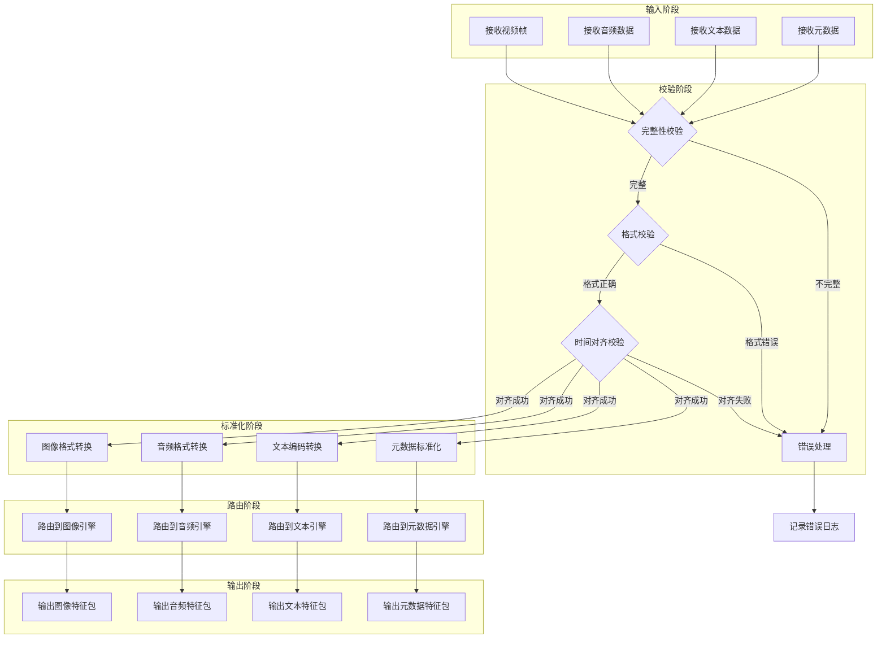
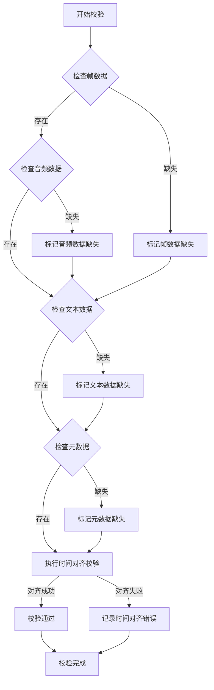
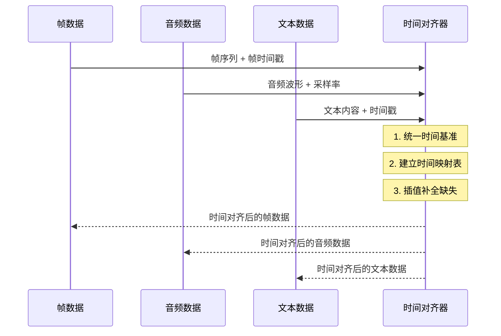

# 预处理特征输入模块设计

## 一、模块定位与核心职责

### 1.1 定位

预处理特征输入模块是**分析引擎层的入口组件**，承担着将预处理层输出转换为分析引擎可处理格式的关键职责，是连接预处理层与分析引擎层的桥梁。

### 1.2 核心职责

| 职责 | 描述 | 重要性 |
|------|------|--------|
| **特征接收** | 接收来自预处理层的多模态原始特征数据 | 高 |
| **格式标准化** | 将不同格式的特征统一为标准格式 | 高 |
| **数据校验** | 验证特征数据的完整性和有效性 | 高 |
| **时间对齐** | 确保多模态特征在时间维度上精确对齐 | 高 |
| **错误处理** | 对无效数据进行降级处理和错误记录 | 中 |
| **特征路由** | 根据特征类型分发到对应处理引擎 | 高 |

---

## 二、架构设计

### 2.1 整体架构图

```
┌─────────────────────────────────────────────────────────────────────────┐
│                    预处理特征输入模块                                   │
├─────────────────────────────────────────────────────────────────────────┤
│                                                                       │
│  ┌─────────────────────────────────────────────────────────────────┐   │
│  │                     输入接口层                                  │   │
│  │  ┌─────────┐  ┌─────────┐  ┌─────────┐  ┌──────────┐          │   │
│  │  │ 视频帧  │  │ 音频数据 │  │ 文本数据 │  │ 元数据   │          │   │
│  │  │ frames  │  │  audio  │  │  text   │  │metadata  │          │   │
│  │  └────┬────┘  └────┬────┘  └────┬────┘  └────┬─────┘          │   │
│  └───────┼────────────┼────────────┼────────────┼─────────────────┘   │
│          │            │            │            │                      │
│          ▼            ▼            ▼            ▼                      │
│  ┌─────────────────────────────────────────────────────────────────┐   │
│  │                     数据校验层                                  │   │
│  │  ┌───────────┐  ┌───────────┐  ┌───────────┐  ┌───────────┐    │   │
│  │  │完整性校验 │  │格式校验   │  │范围校验   │  │时间对齐   │    │   │
│  │  └─────┬─────┘  └─────┬─────┘  └─────┬─────┘  └─────┬─────┘    │   │
│  └───────┼────────────────┼────────────────┼────────────┼─────────┘   │
│          │                │                │            │              │
│          ▼                ▼                ▼            ▼              │
│  ┌─────────────────────────────────────────────────────────────────┐   │
│  │                     格式标准化层                                │   │
│  │  ┌───────────┐  ┌───────────┐  ┌───────────┐  ┌───────────┐    │   │
│  │  │图像格式转换│  │音频格式转换│  │文本编码转换│  │元数据标准化│    │   │
│  │  └─────┬─────┘  └─────┬─────┘  └─────┬─────┘  └─────┬─────┘    │   │
│  └───────┼────────────────┼────────────────┼────────────┼─────────┘   │
│          │                │                │            │              │
│          ▼                ▼                ▼            ▼              │
│  ┌─────────────────────────────────────────────────────────────────┐   │
│  │                     特征路由层                                  │   │
│  │  ┌───────────┐  ┌───────────┐  ┌───────────┐  ┌───────────┐    │   │
│  │  │图像引擎   │  │音频引擎   │  │文本引擎   │  │元数据引擎 │    │   │
│  │  │  路由     │  │  路由     │  │  路由     │  │  路由     │    │   │
│  │  └─────┬─────┘  └─────┬─────┘  └─────┬─────┘  └─────┬─────┘    │   │
│  └───────┼────────────────┼────────────────┼────────────┼─────────┘   │
│          │                │                │            │              │
│          ▼                ▼                ▼            ▼              │
│  ┌─────────────────────────────────────────────────────────────────┐   │
│  │                     输出接口层                                  │   │
│  │  ┌───────────┐  ┌───────────┐  ┌───────────┐  ┌───────────┐    │   │
│  │  │image_feat │  │audio_feat │  │text_feat  │  │meta_feat  │    │   │
│  │  │  特征包   │  │  特征包   │  │  特征包   │  │  特征包   │    │   │
│  │  └───────────┘  └───────────┘  └───────────┘  └───────────┘    │   │
│  └─────────────────────────────────────────────────────────────────┘   │
│                                                                       │
│  ┌─────────────────────────────────────────────────────────────────┐   │
│  │                     监控与日志层                                │   │
│  │  ┌───────────┐  ┌───────────┐  ┌───────────┐  ┌───────────┐    │   │
│  │  │处理状态   │  │错误日志   │  │性能指标   │  │追踪ID     │    │   │
│  │  └───────────┘  └───────────┘  └───────────┘  └───────────┘    │   │
│  └─────────────────────────────────────────────────────────────────┘   │
└─────────────────────────────────────────────────────────────────────────┘
```

### 2.2 分层设计说明

| 层级 | 功能 | 核心组件 |
|------|------|----------|
| **输入接口层** | 接收多模态原始特征 | 特征接收器 |
| **数据校验层** | 验证数据完整性和时间对齐 | 校验器、时间对齐器 |
| **格式标准化层** | 统一数据格式和编码 | 格式转换器 |
| **特征路由层** | 分发特征到对应引擎 | 路由器 |
| **输出接口层** | 输出标准化特征包 | 特征打包器 |
| **监控与日志层** | 记录状态和指标 | 监控器、日志记录器 |

---

## 三、核心处理流程

### 3.1 整体处理流程图



### 3.2 数据校验流程



### 3.3 时间对齐机制



---

## 四、输入输出参数定义

### 4.1 输入参数

| 参数名 | 类型 | 格式 | 描述 | 约束 |
|--------|------|------|------|------|
| **frames** | Array | Array\<Image\> | 视频帧序列 | 非空，帧数量≥1 |
| **frame_timestamps** | Array | Array\<Float\> | 帧级时间戳序列 | 与frames长度一致 |
| **audio** | Array | Array\<Float\> | 音频波形数据（PCM） | 非空，采样率统一 |
| **audio_sample_rate** | Integer | Int | 音频采样率 | 常见值：16000/44100/48000 |
| **text** | String | String | OCR和语音转写文本 | 可为空字符串 |
| **text_timestamps** | Array | Array\<Float\> | 文本时间戳序列 | 与文本段落对应 |
| **metadata** | Object | JSON | 视频元数据 | 包含duration/fps/codec |
| **request_id** | String | UUID | 请求唯一标识 | 非空，用于追踪 |

### 4.2 输出参数

| 参数名 | 类型 | 格式 | 描述 | 约束 |
|--------|------|------|------|------|
| **image_features** | Object | JSON | 图像特征包 | 包含帧数据和元信息 |
| **audio_features** | Object | JSON | 音频特征包 | 包含波形和特征 |
| **text_features** | Object | JSON | 文本特征包 | 包含文本和分词 |
| **meta_features** | Object | JSON | 元数据特征包 | 标准化元信息 |
| **processing_status** | Object | JSON | 处理状态信息 | 包含状态码和错误列表 |
| **request_id** | String | UUID | 请求唯一标识 | 与输入一致 |

### 4.3 特征包结构

**image_features**：
```
{
  "frames": Array<Image>,           // 标准化帧数据
  "frame_count": Integer,           // 帧数量
  "frame_rate": Float,              // 帧率
  "resolution": String,             // 分辨率（如"1920x1080"）
  "timestamps": Array<Float>        // 帧时间戳
}
```

**audio_features**：
```
{
  "waveform": Array<Float>,         // 音频波形
  "sample_rate": Integer,           // 采样率
  "duration": Float,                // 音频时长
  "timestamps": Array<Float>        // 时间戳标记
}
```

**text_features**：
```
{
  "content": String,                // 完整文本内容
  "tokens": Array<String>,          // 分词结果
  "sentences": Array<String>,       // 句子列表
  "timestamps": Array<Float>        // 时间戳序列
}
```

**meta_features**：
```
{
  "duration": Float,                // 视频时长（秒）
  "fps": Integer,                   // 帧率
  "codec": String,                  // 编码格式
  "resolution": String,             // 分辨率
  "bitrate": Integer,               // 比特率
  "file_size": Integer              // 文件大小（字节）
}
```

**processing_status**：
```
{
  "status": String,                 // "success" | "partial" | "failed"
  "error_count": Integer,           // 错误数量
  "errors": Array<Error>,           // 错误详情列表
  "processing_time": Float          // 处理耗时（毫秒）
}
```

---

## 五、关键设计要点

### 5.1 时间对齐机制

| 机制 | 描述 | 实现方式 |
|------|------|----------|
| **时间基准统一** | 将所有时间戳转换为统一基准 | 以视频帧时间戳为基准 |
| **时间映射表** | 建立各模态时间戳的对应关系 | 插值算法构建映射 |
| **缺失补全** | 对缺失数据进行合理填充 | 线性插值/最近邻填充 |
| **同步校验** | 验证时间对齐的准确性 | 计算时间偏差阈值 |

### 5.2 错误处理策略

| 错误类型 | 处理方式 | 降级策略 |
|----------|----------|----------|
| **部分数据缺失** | 标记缺失，继续处理 | 使用默认值或跳过该模态 |
| **格式错误** | 尝试自动转换，失败则标记 | 使用兼容格式替代 |
| **时间对齐失败** | 记录错误，标记时间不同步 | 使用原始时间戳，后续处理注意 |
| **数据损坏** | 记录错误，跳过损坏部分 | 使用前一帧/后一帧替代 |

### 5.3 性能优化

| 优化策略 | 描述 | 预期收益 |
|----------|------|----------|
| **异步处理** | 各模态并行校验和转换 | 提升吞吐量 |
| **零拷贝设计** | 避免不必要的数据复制 | 减少内存开销 |
| **批量处理** | 支持批量特征输入 | 提升处理效率 |
| **缓存机制** | 缓存格式转换结果 | 减少重复计算 |

---

## 六、部署与集成

### 6.1 集成方式

```
┌──────────────┐    ┌──────────────────────────┐    ┌──────────────┐
│  预处理层    │───►│   预处理特征输入模块     │───►│   分析引擎层  │
│  (Preprocess)│    │  (Feature Input Module) │    │  (Engines)   │
└──────────────┘    └──────────────────────────┘    └──────────────┘
```

### 6.2 接口规范

**输入接口**：
- **协议**：gRPC / HTTP
- **序列化**：Protocol Buffers / JSON
- **压缩**：gzip / snappy

**输出接口**：
- **协议**：gRPC / HTTP
- **序列化**：Protocol Buffers / JSON
- **压缩**：gzip / snappy

### 6.3 监控指标

| 指标类型 | 具体指标 | 监控目标 |
|----------|----------|----------|
| **性能指标** | 处理延迟、吞吐量、并发数 | 系统负载评估 |
| **质量指标** | 校验通过率、错误率、降级率 | 数据质量评估 |
| **业务指标** | 请求成功率、平均处理时间 | 服务健康度 |

---

## 总结

预处理特征输入模块通过标准化、校验、时间对齐和路由四大核心能力，实现了多模态特征的统一处理和分发。其设计兼顾了数据质量保证、处理效率和系统可观测性，为后续分析引擎层提供了可靠的输入基础。时间对齐机制和错误处理策略确保了系统在面对不完整或异常数据时的健壮性，而性能优化策略则保证了系统的高吞吐量和低延迟。