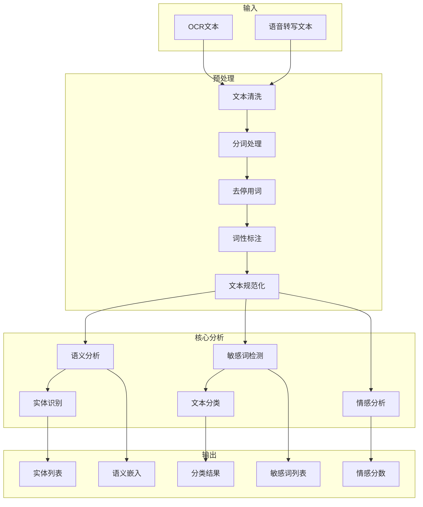
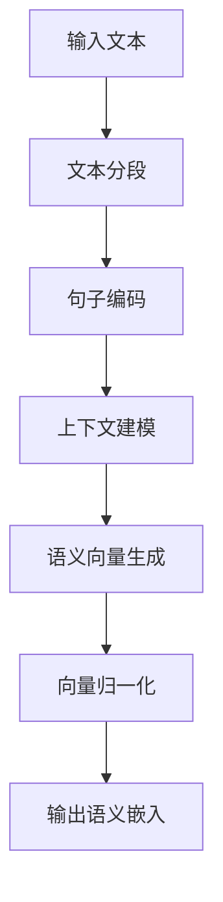
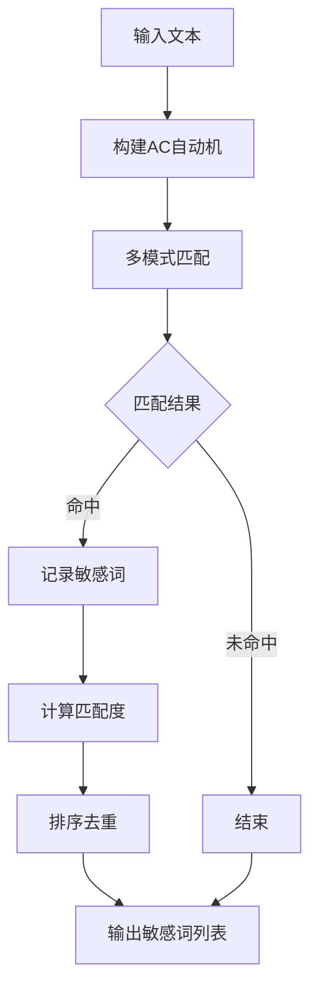
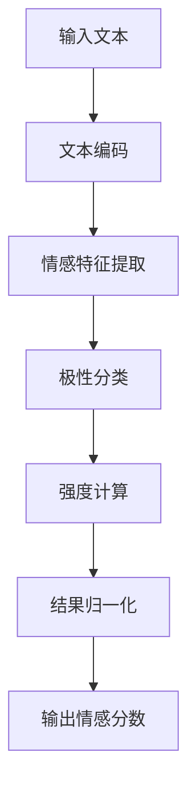

# 文本分析引擎架构方案

## 一、引擎定位与核心职责

### 1.1 定位

文本分析引擎是分析引擎层的**核心组件之一**，负责处理视频内容中的文本信息（包括OCR识别文本和语音转写文本），提供语义理解、敏感词检测和情感分析能力。

### 1.2 核心职责

| 职责 | 描述 | 重要性 |
|------|------|--------|
| **文本预处理** | 清洗、分词、规范化文本数据 | 高 |
| **语义理解** | 提取文本语义特征和上下文信息 | 高 |
| **敏感词检测** | 识别预定义的敏感词汇和模式 | 高 |
| **情感分析** | 判断文本的情感倾向和情绪强度 | 中 |
| **实体识别** | 识别文本中的命名实体（人物、地点、组织等） | 中 |
| **特征输出** | 输出结构化的文本特征供后续处理 | 高 |

---

## 二、架构设计

### 2.1 整体架构图

```
┌──────────────────────────────────────────────────────────────────────────┐
│                        文本分析引擎 (Text Analysis Engine)               │
├──────────────────────────────────────────────────────────────────────────┤
│                                                                          │
│  ┌────────────────────────────────────────────────────────────────────┐  │
│  │                        输入层                                     │  │
│  │  ┌───────────────┐         ┌───────────────┐                      │  │
│  │  │ OCR识别文本   │         │ 语音转写文本  │                      │  │
│  │  │  (raw_text)   │         │  (transcript) │                      │  │
│  │  └───────┬───────┘         └───────┬───────┘                      │  │
│  └──────────┼─────────────────────────┼───────────────────────────────┘  │
│             │                         │                                  │
│             └───────────┬─────────────┘                                  │
│                         ▼                                                │
│  ┌────────────────────────────────────────────────────────────────────┐  │
│  │                   文本预处理模块                                   │  │
│  │  ┌─────────┐ ┌─────────┐ ┌─────────┐ ┌─────────┐ ┌─────────┐     │  │
│  │  │ 清洗    │→│ 分词    │→│ 去停用词 │→│ 词性标注 │→│ 规范化  │     │  │
│  │  └─────────┘ └─────────┘ └─────────┘ └─────────┘ └─────────┘     │  │
│  └─────────────────────────────┬─────────────────────────────────────┘  │
│                                ▼                                        │
│  ┌────────────────────────────────────────────────────────────────────┐  │
│  │                     核心分析模块                                   │  │
│  │  ┌─────────────────┐    ┌─────────────────┐    ┌───────────────┐   │  │
│  │  │   语义分析器    │    │   敏感词检测器   │    │   情感分析器  │   │  │
│  │  │  (Semantic)     │    │  (KeywordMatch) │    │  (Sentiment)  │   │  │
│  │  └────────┬────────┘    └────────┬────────┘    └───────┬───────┘   │  │
│  │           │                      │                      │          │  │
│  │           └───────────┬──────────┴───────────┬──────────┘          │  │
│  │                       ▼                      ▼                      │  │
│  │              ┌───────────────┐    ┌───────────────┐                 │  │
│  │              │   实体识别器  │    │   文本分类器  │                 │  │
│  │              │  (NER)        │    │  (Classifier) │                 │  │
│  │              └───────────────┘    └───────────────┘                 │  │
│  └─────────────────────────────┬─────────────────────────────────────┘  │
│                                ▼                                        │
│  ┌────────────────────────────────────────────────────────────────────┐  │
│  │                   特征融合与输出模块                               │  │
│  │  ┌───────────────┐         ┌───────────────┐                       │  │
│  │  │ 特征归一化    │         │ 特征打包输出  │                       │  │
│  │  └───────────────┘         └───────────────┘                       │  │
│  └────────────────────────────────────────────────────────────────────┘  │
│                                ▼                                        │
│  ┌────────────────────────────────────────────────────────────────────┐  │
│  │                        输出层                                     │  │
│  │  ┌───────────────┐ ┌───────────────┐ ┌───────────────┐ ┌────────┐   │  │
│  │  │语义嵌入向量   │ │敏感词列表     │ │情感分数       │ │实体列表│   │  │
│  │  │  embedding   │ │sens_words    │ │ sentiment    │ │ entities│   │  │
│  │  └───────────────┘ └───────────────┘ └───────────────┘ └────────┘   │  │
│  └────────────────────────────────────────────────────────────────────┘  │
└──────────────────────────────────────────────────────────────────────────┘
```

### 2.2 模块划分与功能说明

| 模块 | 功能描述 | 核心能力 |
|------|----------|----------|
| **文本预处理模块** | 对原始文本进行清洗和规范化处理 | 清洗、分词、去停用词、词性标注、规范化 |
| **语义分析器** | 提取文本的语义特征和上下文信息 | 语义编码、上下文理解、句向量生成 |
| **敏感词检测器** | 识别文本中的敏感词汇和模式 | 精确匹配、模糊匹配、正则匹配 |
| **情感分析器** | 判断文本的情感倾向 | 情感极性判断、情绪强度评估 |
| **实体识别器** | 识别文本中的命名实体 | 人物、地点、组织、时间等实体识别 |
| **文本分类器** | 对文本进行主题分类 | 违规类型分类、内容主题识别 |
| **特征融合模块** | 将各分析结果融合为统一特征 | 特征归一化、特征打包 |

---

## 三、核心处理流程

### 3.1 整体处理流程图



### 3.2 语义分析流程



### 3.3 敏感词检测流程



### 3.4 情感分析流程



---

## 四、输入输出参数定义

### 4.1 输入参数

| 参数名 | 类型 | 格式 | 描述 | 约束 |
|--------|------|------|------|------|
| **text** | String | String | 原始文本内容 | 非空，最大长度10000字符 |
| **text_type** | String | Enum | 文本类型 | "ocr" / "transcript" |
| **language** | String | String | 文本语言 | "zh" / "en" / "mix" |
| **context** | Object | JSON | 上下文信息 | 可选，包含时间戳等 |
| **request_id** | String | UUID | 请求唯一标识 | 非空 |

### 4.2 输出参数

| 参数名 | 类型 | 格式 | 描述 | 约束 |
|--------|------|------|------|------|
| **semantic_embedding** | Array | Array\<Float\> | 语义嵌入向量 | 固定维度（如768维） |
| **sensitive_words** | Array | Array\<Object\> | 敏感词列表 | 包含词、位置、匹配类型 |
| **sentiment_score** | Float | Float | 情感分数 | -1到1区间 |
| **entities** | Array | Array\<Object\> | 实体列表 | 包含实体、类型、位置 |
| **category** | String | String | 文本分类结果 | 违规类型或主题 |
| **confidence** | Float | Float | 分类置信度 | 0到1区间 |
| **processing_status** | Object | JSON | 处理状态 | 包含状态码和错误信息 |
| **request_id** | String | UUID | 请求唯一标识 | 与输入一致 |

### 4.3 输出结构详细定义

**sensitive_words 结构**：
```
{
  "word": String,           // 敏感词内容
  "start_pos": Integer,     // 起始位置
  "end_pos": Integer,       // 结束位置
  "match_type": String,     // "exact" | "fuzzy" | "regex"
  "category": String,       // 敏感词类别
  "confidence": Float       // 匹配置信度
}
```

**entities 结构**：
```
{
  "entity": String,         // 实体内容
  "type": String,           // 实体类型："person" | "location" | "organization" | "time" | "other"
  "start_pos": Integer,     // 起始位置
  "end_pos": Integer,       // 结束位置
  "confidence": Float       // 识别置信度
}
```

**processing_status 结构**：
```
{
  "status": String,         // "success" | "partial" | "failed"
  "error_count": Integer,   // 错误数量
  "errors": Array<Error>,   // 错误详情
  "processing_time": Float  // 处理耗时（毫秒）
}
```

---

## 五、各模块功能细节

### 5.1 文本预处理模块

| 子模块 | 功能描述 | 处理内容 |
|--------|----------|----------|
| **文本清洗** | 去除噪声和特殊字符 | 去除HTML标签、特殊符号、多余空格 |
| **分词处理** | 将文本切分为词语 | 中文分词（支持多粒度）、英文分词 |
| **去停用词** | 移除无意义词汇 | 移除标点、虚词、高频无意义词 |
| **词性标注** | 标注词语的词性 | 名词、动词、形容词等词性标注 |
| **文本规范化** | 统一文本格式 | 大小写转换、繁简转换、数字规范化 |

### 5.2 语义分析器

| 功能 | 描述 | 技术实现 |
|------|------|----------|
| **文本编码** | 将文本转换为向量表示 | Transformer编码器 |
| **上下文建模** | 捕捉上下文依赖关系 | 自注意力机制 |
| **语义向量生成** | 生成句子/段落级向量 | 池化策略（CLS、均值、最大） |
| **向量归一化** | 统一向量尺度 | L2归一化 |

### 5.3 敏感词检测器

| 功能 | 描述 | 实现方式 |
|------|------|----------|
| **精确匹配** | 完全匹配敏感词库 | AC自动机 |
| **模糊匹配** | 支持变形和变体 | 编辑距离、拼音匹配 |
| **正则匹配** | 支持复杂模式匹配 | 正则表达式引擎 |
| **词形还原** | 支持词形变化匹配 | 词根提取、词形还原 |

### 5.4 情感分析器

| 功能 | 描述 | 分析维度 |
|------|------|----------|
| **极性判断** | 判断情感方向 | 正面/负面/中性 |
| **强度评估** | 量化情感强度 | 0到1区间 |
| **情绪识别** | 识别具体情绪类型 | 愤怒、喜悦、悲伤、恐惧等 |
| **上下文感知** | 结合上下文判断 | 否定词处理、程度副词处理 |

### 5.5 实体识别器

| 实体类型 | 描述 | 识别目标 |
|----------|------|----------|
| **人物** | 人名识别 | 真实人物、虚构人物 |
| **地点** | 地点识别 | 城市、国家、地标 |
| **组织** | 组织识别 | 公司、机构、政府 |
| **时间** | 时间识别 | 日期、时间点、时间段 |
| **其他** | 其他实体 | 事件、产品、概念 |

### 5.6 文本分类器

| 分类维度 | 描述 | 类别示例 |
|----------|------|----------|
| **违规类型** | 内容违规分类 | 色情、暴力、政治、广告、版权 |
| **内容主题** | 内容主题识别 | 新闻、娱乐、教育、科技、体育 |
| **语言类型** | 语言识别 | 中文、英文、混合语言 |
| **内容风格** | 风格识别 | 正式、口语、幽默、讽刺 |

---

## 六、关键设计要点

### 6.1 多语言支持

| 语言 | 支持程度 | 特殊处理 |
|------|----------|----------|
| **中文** | 完全支持 | 分词、繁简转换 |
| **英文** | 完全支持 | 词形还原、大小写处理 |
| **混合语言** | 支持 | 语言检测、混合处理 |

### 6.2 上下文感知

| 上下文类型 | 处理方式 | 作用 |
|------------|----------|------|
| **否定词处理** | 检测否定词并反转情感 | 提升情感分析准确性 |
| **程度副词处理** | 调整情感强度 | 提升情感分析精度 |
| **时间上下文** | 结合时间戳分析 | 支持时序文本分析 |

### 6.3 性能优化

| 优化策略 | 描述 | 预期收益 |
|----------|------|----------|
| **批量处理** | 支持批量文本输入 | 提升处理效率 |
| **缓存机制** | 缓存高频词汇和特征 | 减少重复计算 |
| **增量更新** | 支持敏感词库增量更新 | 降低维护成本 |
| **并行处理** | 多模块并行分析 | 提升吞吐量 |

### 6.4 可扩展性设计

| 扩展维度 | 设计方式 | 实现路径 |
|----------|----------|----------|
| **新语言支持** | 插件化设计 | 添加语言处理插件 |
| **新敏感词类型** | 规则配置化 | 通过配置文件添加 |
| **新实体类型** | 模型微调 | 增量训练实体识别模型 |
| **新分类维度** | 分类器扩展 | 添加新分类头 |

---

## 七、部署与集成

### 7.1 部署架构

```
┌───────────────────────────────────────────────────────────────┐
│                   文本分析引擎部署架构                        │
├───────────────────────────────────────────────────────────────┤
│                                                               │
│  ┌─────────────────────────────────────────────────────────┐ │
│  │                   文本分析引擎集群                       │ │
│  │  ┌──────────┐  ┌──────────┐  ┌──────────┐  ┌──────────┐ │ │
│  │  │  Pod 1   │  │  Pod 2   │  │  Pod 3   │  │  Pod 4   │ │ │
│  │  │ (CPU)    │  │ (CPU)    │  │ (CPU)    │  │ (CPU)    │ │ │
│  │  └────┬─────┘  └────┬─────┘  └────┬─────┘  └────┬─────┘ │ │
│  └───────┼─────────────┼─────────────┼─────────────┼─────────┘ │
│          │             │             │             │            │
│          ▼             ▼             ▼             ▼            │
│  ┌─────────────────────────────────────────────────────────┐   │
│  │                  共享资源层                             │   │
│  │  ┌───────────┐         ┌───────────┐                  │   │
│  │  │ 敏感词库   │         │ 模型仓库  │                  │   │
│  │  │ (Redis)   │         │(ModelHub)│                  │   │
│  │  └───────────┘         └───────────┘                  │   │
│  └─────────────────────────────────────────────────────────┘   │
└───────────────────────────────────────────────────────────────┘
```

### 7.2 集成接口

| 接口类型 | 协议 | 序列化 | 压缩 |
|----------|------|--------|------|
| **输入接口** | gRPC / HTTP | Protocol Buffers / JSON | gzip |
| **输出接口** | gRPC / HTTP | Protocol Buffers / JSON | gzip |

### 7.3 监控指标

| 指标类型 | 具体指标 | 监控目标 |
|----------|----------|----------|
| **性能指标** | 处理延迟、吞吐量、并发数 | 系统负载 |
| **质量指标** | 敏感词召回率、情感准确率、实体识别F1 | 分析质量 |
| **业务指标** | 敏感词命中次数、违规文本比例 | 业务健康度 |

---

## 总结

文本分析引擎通过多层次的文本处理和分析能力，为视频违规审核提供了关键的文本理解支持。其模块化设计支持灵活扩展，多语言支持和上下文感知能力提升了分析的准确性和适应性。性能优化策略确保了系统的高吞吐量和低延迟，监控指标则为系统运维提供了全面的可观测性。该引擎与图像引擎、音频引擎协同工作，共同构成完整的多模态分析能力。