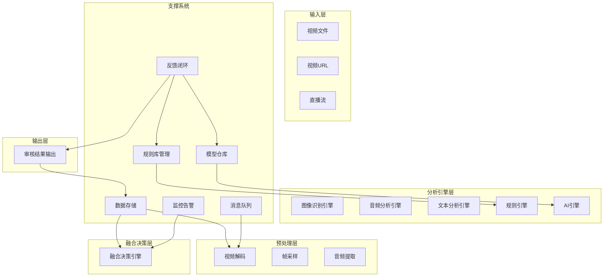

# 支撑系统设计方案

## 一、设计目标与定位

### 1.1 核心目标
支撑系统作为视频违规审核系统的基础设施层，为各业务模块提供稳定、高效的基础服务，确保整个系统的可靠运行和持续迭代优化。

### 1.2 定位与边界
- **上游依赖**：无（基础设施层）
- **下游服务**：输入层、预处理层、分析引擎层、融合决策层、输出层
- **职责边界**：提供规则管理、模型管理、数据存储、消息传递、监控告警、反馈闭环等支撑能力

### 1.3 设计原则
- **高可用性**：保证服务的高可用和故障恢复能力
- **可扩展性**：支持系统水平扩展，应对业务增长
- **可观测性**：提供全面的监控和日志能力
- **安全性**：保障数据安全和系统安全
- **可维护性**：便于运维和管理

---

## 二、整体架构设计

### 2.1 架构图

```
┌─────────────────────────────────────────────────────────────────────────────┐
│                           支撑系统                                       │
├─────────────────────────────────────────────────────────────────────────────┤
│                                                                             │
│  ┌──────────────────┐    ┌──────────────────┐    ┌──────────────────┐      │
│  │   规则库管理系统  │    │    模型仓库系统   │    │    数据存储系统   │      │
│  │  (Rule Manager) │    │  (Model Hub)     │    │  (Data Storage)  │      │
│  └────────┬─────────┘    └────────┬─────────┘    └────────┬─────────┘      │
│           │                       │                       │                │
│           │                       │                       │                │
│  ┌────────┴─────────┐    ┌────────┴─────────┐    ┌────────┴─────────┐      │
│  │   消息队列系统    │    │    监控告警系统   │    │   反馈闭环系统    │      │
│  │  (Message Queue)│    │  (Monitoring)    │    │  (Feedback Loop) │      │
│  └──────────────────┘    └──────────────────┘    └──────────────────┘      │
│                                                                             │
│  ┌────────────────────────────────────────────────────────────────────────┐  │
│  │                          统一服务层                                   │  │
│  │  ┌──────────┐ ┌──────────┐ ┌──────────┐ ┌──────────┐ ┌──────────┐   │  │
│  │  │API网关   │ │认证授权  │ │配置中心  │ │日志服务  │ │追踪服务  │   │  │
│  │  └──────────┘ └──────────┘ └──────────┘ └──────────┘ └──────────┘   │  │
│  └────────────────────────────────────────────────────────────────────────┘  │
│                                                                             │
└─────────────────────────────────────────────────────────────────────────────┘
```

### 2.2 模块划分

| 模块名称 | 职责描述 | 核心能力 |
|----------|----------|----------|
| **规则库管理系统** | 规则的全生命周期管理 | 规则配置、版本控制、导入导出 |
| **模型仓库系统** | AI模型的管理和部署 | 模型存储、版本管理、A/B测试 |
| **数据存储系统** | 数据的持久化存储 | 结构化数据、非结构化数据、缓存 |
| **消息队列系统** | 异步消息传递 | 解耦、流量削峰、异步处理 |
| **监控告警系统** | 系统监控和告警 | 指标监控、日志追踪、异常告警 |
| **反馈闭环系统** | 人工复核和数据回流 | 反馈收集、数据分析、模型迭代 |
| **统一服务层** | 通用服务能力 | API网关、认证授权、配置中心 |

---

## 三、与其他层的协作关系

### 3.1 协作架构图



### 3.2 协作关系说明

| 支撑模块 | 上游依赖 | 下游服务 | 协作方式 |
|----------|----------|----------|----------|
| **规则库管理** | 反馈闭环系统 | 规则引擎 | 规则配置下发、版本同步 |
| **模型仓库** | 反馈闭环系统 | AI引擎 | 模型部署、版本切换 |
| **数据存储** | 所有业务模块 | 所有业务模块 | 数据持久化、缓存查询 |
| **消息队列** | 预处理层 | 分析引擎层 | 异步任务分发、流量削峰 |
| **监控告警** | 所有业务模块 | 运维人员 | 指标采集、异常告警 |
| **反馈闭环** | 输出层（人工复核） | 规则库管理、模型仓库 | 反馈收集、数据回流 |

---

## 四、各模块详细设计

### 4.1 规则库管理系统

**核心职责**：管理规则的全生命周期，支持规则的配置、版本控制和动态更新

#### 4.1.1 功能模块

| 子模块 | 功能描述 |
|--------|----------|
| **规则配置管理** | 规则的增删改查、状态管理 |
| **版本控制** | 规则版本记录、回滚、对比 |
| **规则导入导出** | 批量导入导出规则配置 |
| **规则验证** | 规则语法验证、冲突检测 |
| **规则发布** | 规则上线、灰度发布 |

#### 4.1.2 输入参数

| 参数名 | 类型 | 描述 | 约束 |
|--------|------|------|------|
| rule_id | string | 规则唯一标识 | 非空 |
| name | string | 规则名称 | 非空，最大100字符 |
| type | string | 规则类型 | "blacklist" / "whitelist" / "threshold" / "composite" |
| condition | string | 条件表达式 | 符合DSL语法 |
| action | dict | 动作配置 | 包含type和params |
| priority | int | 规则优先级 | 0-100 |
| enabled | bool | 是否启用 | 默认true |
| tags | list | 标签列表 | 用于分类 |

#### 4.1.3 输出参数

| 参数名 | 类型 | 描述 | 约束 |
|--------|------|------|------|
| rule_id | string | 规则ID | 唯一 |
| name | string | 规则名称 | - |
| type | string | 规则类型 | - |
| status | string | 状态 | "enabled" / "disabled" / "draft" |
| version | string | 版本号 | 语义化版本 |
| created_at | datetime | 创建时间 | - |
| updated_at | datetime | 更新时间 | - |

#### 4.1.4 业务流程

```
规则创建/更新请求
    │
    ▼
┌─────────────────────────┐
│ 规则配置验证           │
│ 语法检查、冲突检测     │
└──────────┬──────────────┘
           │验证通过
           ▼
┌─────────────────────────┐
│ 版本管理               │
│ 创建新版本记录         │
└──────────┬──────────────┘
           │
           ▼
┌─────────────────────────┐
│ 规则发布               │
│ 更新缓存、通知下游     │
└─────────────────────────┘
```

---

### 4.2 模型仓库系统

**核心职责**：管理AI模型的存储、版本和部署

#### 4.2.1 功能模块

| 子模块 | 功能描述 |
|--------|----------|
| **模型存储** | 模型文件存储、元数据管理 |
| **版本管理** | 模型版本记录、回滚 |
| **模型部署** | 模型上线、灰度发布 |
| **A/B测试** | 多版本模型对比测试 |
| **模型监控** | 模型性能监控、效果评估 |

#### 4.2.2 输入参数

| 参数名 | 类型 | 描述 | 约束 |
|--------|------|------|------|
| model_id | string | 模型唯一标识 | 非空 |
| name | string | 模型名称 | 非空 |
| type | string | 模型类型 | "image" / "audio" / "text" / "multimodal" |
| framework | string | 框架类型 | "pytorch" / "tensorflow" / "onnx" |
| version | string | 版本号 | 语义化版本 |
| file_path | string | 模型文件路径 | 非空 |
| metadata | dict | 模型元数据 | 包含输入输出格式、性能指标 |
| status | string | 状态 | "draft" / "staging" / "production" |

#### 4.2.3 输出参数

| 参数名 | 类型 | 描述 | 约束 |
|--------|------|------|------|
| model_id | string | 模型ID | 唯一 |
| name | string | 模型名称 | - |
| type | string | 模型类型 | - |
| version | string | 当前版本 | - |
| status | string | 部署状态 | - |
| metrics | dict | 性能指标 | 包含准确率、F1、延迟 |
| deployed_at | datetime | 部署时间 | - |

#### 4.2.4 业务流程

```
模型上传请求
    │
    ▼
┌─────────────────────────┐
│ 模型文件校验           │
│ 格式验证、大小检查     │
└──────────┬──────────────┘
           │验证通过
           ▼
┌─────────────────────────┐
│ 模型存储               │
│ 上传至对象存储         │
└──────────┬──────────────┘
           │
           ▼
┌─────────────────────────┐
│ 版本记录               │
│ 创建版本元数据         │
└──────────┬──────────────┘
           │
           ▼
┌─────────────────────────┐
│ 模型部署               │
│ 更新推理服务           │
└─────────────────────────┘
```

---

### 4.3 数据存储系统

**核心职责**：提供高效可靠的数据存储服务

#### 4.3.1 功能模块

| 子模块 | 功能描述 | 技术选型 |
|--------|----------|----------|
| **关系型存储** | 结构化数据存储 | PostgreSQL |
| **缓存存储** | 热点数据缓存 | Redis |
| **对象存储** | 非结构化数据存储 | MinIO / S3 |
| **时序存储** | 时序数据存储 | InfluxDB |

#### 4.3.2 存储结构

| 存储类型 | 存储内容 | 表/桶名称 |
|----------|----------|-----------|
| **关系型** | 审核记录、规则配置、模型元数据 | audit_records, rules, models |
| **缓存** | 规则缓存、特征缓存、会话数据 | rules_cache, features_cache |
| **对象存储** | 视频文件、模型文件、结果文件 | videos, models, results |
| **时序** | 监控指标、性能数据 | metrics |

#### 4.3.3 输入输出

**写入操作**

| 参数名 | 类型 | 描述 |
|--------|------|------|
| data_type | string | 数据类型 |
| data | dict | 数据内容 |
| ttl | int | 过期时间（秒） |

**读取操作**

| 参数名 | 类型 | 描述 |
|--------|------|------|
| data_type | string | 数据类型 |
| query | dict | 查询条件 |
| limit | int | 返回数量限制 |

#### 4.3.4 业务流程

```
数据写入请求
    │
    ▼
┌─────────────────────────┐
│ 数据分类               │
│ 判断数据类型           │
└──────────┬──────────────┘
           │
           ├───► 结构化数据 ──► PostgreSQL
           │
           ├───► 热点数据 ──► Redis
           │
           ├───► 大文件 ──► 对象存储
           │
           └───► 时序数据 ──► InfluxDB
```

---

### 4.4 消息队列系统

**核心职责**：提供异步消息传递能力

#### 4.4.1 功能模块

| 子模块 | 功能描述 |
|--------|----------|
| **消息生产** | 消息发布、分区路由 |
| **消息消费** | 消息订阅、批量处理 |
| **消息存储** | 消息持久化、重试机制 |
| **流量控制** | 限流、削峰填谷 |

#### 4.4.2 队列设计

| 队列名称 | 用途 | 分区策略 | 保留时间 |
|----------|------|----------|----------|
| video_tasks | 视频处理任务 | 按video_id哈希 | 7天 |
| audit_results | 审核结果 | 按时间分区 | 30天 |
| feedback_events | 反馈事件 | 按时间分区 | 7天 |
| monitor_metrics | 监控指标 | 按时间分区 | 15天 |

#### 4.4.3 消息格式

```json
{
  "message_id": "uuid",
  "topic": "video_tasks",
  "partition": 0,
  "key": "video_id",
  "value": {
    "video_id": "vid_001",
    "task_type": "audit",
    "payload": {...},
    "timestamp": "2024-01-01T12:00:00Z"
  },
  "headers": {...}
}
```

#### 4.4.4 业务流程

```
消息生产
    │
    ▼
┌─────────────────────────┐
│ 消息封装               │
│ 添加元数据、序列化     │
└──────────┬──────────────┘
           │
           ▼
┌─────────────────────────┐
│ 路由分发               │
│ 根据key路由到分区     │
└──────────┬──────────────┘
           │
           ▼
┌─────────────────────────┐
│ 持久化存储             │
│ 写入磁盘               │
└──────────┬──────────────┘
           │
           ▼
┌─────────────────────────┐
│ 消息投递               │
│ 推送给消费者           │
└─────────────────────────┘
```

---

### 4.5 监控告警系统

**核心职责**：提供系统监控和异常告警能力

#### 4.5.1 功能模块

| 子模块 | 功能描述 |
|--------|----------|
| **指标采集** | 性能指标、业务指标采集 |
| **日志收集** | 结构化日志收集、存储 |
| **分布式追踪** | 请求链路追踪 |
| **告警管理** | 告警规则配置、通知 |
| **可视化** | 监控大屏、报表展示 |

#### 4.5.2 监控指标

| 指标类型 | 具体指标 | 采集频率 |
|----------|----------|----------|
| **性能指标** | QPS、延迟、吞吐量、错误率 | 1分钟 |
| **资源指标** | CPU、内存、磁盘、网络 | 1分钟 |
| **业务指标** | 审核通过率、违规率、复核率 | 5分钟 |
| **模型指标** | 准确率、召回率、F1分数 | 小时 |

#### 4.5.3 告警规则

| 告警级别 | 条件示例 | 通知方式 |
|----------|----------|----------|
| **Critical** | 服务不可用、数据库连接池耗尽 | 电话 + 短信 + 钉钉 |
| **Warning** | 延迟超过阈值、错误率上升 | 钉钉 + 邮件 |
| **Info** | 规则更新、模型部署 | 邮件 |

#### 4.5.4 业务流程

```
指标采集
    │
    ▼
┌─────────────────────────┐
│ 指标收集               │
│ 从各服务采集指标       │
└──────────┬──────────────┘
           │
           ▼
┌─────────────────────────┐
│ 指标存储               │
│ 写入时序数据库         │
└──────────┬──────────────┘
           │
           ▼
┌─────────────────────────┐
│ 告警判断               │
│ 对比阈值规则           │
└──────────┬──────────────┘
           │触发告警
           ▼
┌─────────────────────────┐
│ 告警通知               │
│ 发送通知到指定渠道     │
└─────────────────────────┘
```

---

### 4.6 反馈闭环系统

**核心职责**：收集人工复核反馈，驱动规则和模型优化

#### 4.6.1 功能模块

| 子模块 | 功能描述 |
|--------|----------|
| **反馈收集** | 人工复核结果收集 |
| **数据分析** | 反馈数据统计分析 |
| **规则挖掘** | 从反馈中挖掘新规则 |
| **模型迭代** | 反馈数据用于模型训练 |
| **效果评估** | 优化效果评估 |

#### 4.6.2 输入参数

| 参数名 | 类型 | 描述 | 约束 |
|--------|------|------|------|
| video_id | string | 视频ID | 非空 |
| original_decision | string | 原始决策 | "pass" / "reject" / "review" |
| corrected_decision | string | 修正决策 | "pass" / "reject" / "review" |
| correction_reason | string | 修正原因 | 可选 |
| corrector_id | string | 审核人员ID | 非空 |

#### 4.6.3 输出参数

| 参数名 | 类型 | 描述 | 约束 |
|--------|------|------|------|
| feedback_id | string | 反馈ID | 唯一 |
| video_id | string | 视频ID | - |
| status | string | 处理状态 | "pending" / "analyzed" / "applied" |
| analysis_result | dict | 分析结果 | 包含规则建议、模型训练数据 |

#### 4.6.4 业务流程

```
人工复核反馈
    │
    ▼
┌─────────────────────────┐
│ 反馈收集               │
│ 记录复核结果           │
└──────────┬──────────────┘
           │
           ▼
┌─────────────────────────┐
│ 数据分析               │
│ 统计分析反馈数据       │
└──────────┬──────────────┘
           │
           ▼
┌─────────────────────────┐
│ 规则挖掘               │
│ 发现潜在规则模式       │
└──────────┬──────────────┘
           │
           ▼
┌─────────────────────────┐
│ 更新规则库             │
│ 添加新规则或调整权重   │
└──────────┬──────────────┘
           │
           ▼
┌─────────────────────────┐
│ 模型再训练             │
│ 使用反馈数据微调模型   │
└─────────────────────────┘
```

---

### 4.7 统一服务层

**核心职责**：提供通用服务能力

#### 4.7.1 功能模块

| 子模块 | 功能描述 | 技术选型 |
|--------|----------|----------|
| **API网关** | 请求路由、负载均衡、限流 | Nginx / Kong |
| **认证授权** | 用户认证、权限管理 | JWT + RBAC |
| **配置中心** | 配置管理、动态更新 | Spring Cloud Config / Consul |
| **日志服务** | 日志收集、查询 | ELK Stack |
| **追踪服务** | 分布式链路追踪 | OpenTelemetry + Jaeger |

#### 4.7.2 API网关设计

| 功能 | 描述 |
|------|------|
| **请求路由** | 根据路径路由到对应服务 |
| **负载均衡** | 轮询、最少连接、IP哈希 |
| **限流熔断** | 防止服务过载 |
| **安全防护** | WAF、请求验证 |

#### 4.7.3 认证授权设计

| 组件 | 功能 |
|------|------|
| **认证服务** | JWT令牌签发和验证 |
| **权限服务** | RBAC权限校验 |
| **会话管理** | 会话状态管理 |

---

## 五、关键设计要点

### 5.1 高可用性设计

| 策略 | 描述 | 实施方式 |
|------|------|----------|
| **多活部署** | 多数据中心部署 | 跨区域部署 |
| **故障转移** | 自动切换到备用节点 | Keepalived / Kubernetes |
| **数据备份** | 定期备份数据 | 增量备份 + 全量备份 |
| **灾难恢复** | 数据恢复演练 | 定期灾备演练 |

### 5.2 可扩展性设计

| 策略 | 描述 | 实施方式 |
|------|------|----------|
| **水平扩展** | 添加节点增加处理能力 | Kubernetes自动扩缩容 |
| **读写分离** | 分离读和写操作 | PostgreSQL主从复制 |
| **分片存储** | 按key分片存储 | Consistent Hashing |

### 5.3 安全性设计

| 策略 | 描述 | 实施方式 |
|------|------|----------|
| **数据加密** | 静态数据和传输数据加密 | AES-256 + TLS 1.3 |
| **访问控制** | 细粒度权限控制 | RBAC |
| **审计日志** | 记录所有操作 | 操作日志记录 |
| **安全扫描** | 定期安全扫描 | 漏洞扫描工具 |

### 5.4 可观测性设计

| 策略 | 描述 | 实施方式 |
|------|------|----------|
| **结构化日志** | 统一日志格式 | JSON格式 |
| **指标监控** | 全面指标采集 | Prometheus |
| **分布式追踪** | 请求链路追踪 | OpenTelemetry |
| **告警通知** | 多渠道告警 | 钉钉、邮件、电话 |

---

## 六、部署架构

### 6.1 物理架构

```
┌─────────────────────────────────────────────────────────────────┐
│                        支撑系统部署架构                           │
├─────────────────────────────────────────────────────────────────┤
│                                                                 │
│  ┌─────────────────────────────────────────────────────────┐   │
│  │                      控制平面                           │   │
│  │  ┌──────────┐ ┌──────────┐ ┌──────────┐ ┌──────────┐   │   │
│  │  │API网关   │ │配置中心  │ │认证服务  │ │监控服务  │   │   │
│  │  └──────────┘ └──────────┘ └──────────┘ └──────────┘   │   │
│  └──────────────────────────┬──────────────────────────────┘   │
│                             │                                  │
│                             ▼                                  │
│  ┌─────────────────────────────────────────────────────────┐   │
│  │                      数据平面                           │   │
│  │  ┌──────────┐ ┌──────────┐ ┌──────────┐ ┌──────────┐   │   │
│  │  │PostgreSQL│ │   Redis  │ │  Kafka   │ │ MinIO    │   │   │
│  │  │ (主从)   │ │ (集群)   │ │ (3节点)  │ │ (集群)   │   │   │
│  │  └──────────┘ └──────────┘ └──────────┘ └──────────┘   │   │
│  └─────────────────────────────────────────────────────────┘   │
│                                                                 │
└─────────────────────────────────────────────────────────────────┘
```

### 6.2 网络架构

| 网络分区 | 功能 | 安全策略 |
|----------|------|----------|
| **前端区** | API网关、负载均衡 | 公网访问、WAF防护 |
| **应用区** | 业务服务、支撑服务 | 内网访问、防火墙 |
| **数据区** | 数据库、存储 | 严格访问控制 |
| **管理区** | 监控、运维 | 运维专用网络 |

---

## 七、总结

支撑系统作为视频违规审核系统的基础设施层，通过六大核心模块提供全面的支撑能力：

- **规则库管理系统**：规则全生命周期管理
- **模型仓库系统**：AI模型管理和部署
- **数据存储系统**：高效可靠的数据存储
- **消息队列系统**：异步消息传递和解耦
- **监控告警系统**：系统监控和异常告警
- **反馈闭环系统**：人工复核和数据回流

该设计确保了系统的高可用性、可扩展性、安全性和可观测性，为业务模块提供稳定可靠的基础服务支持。