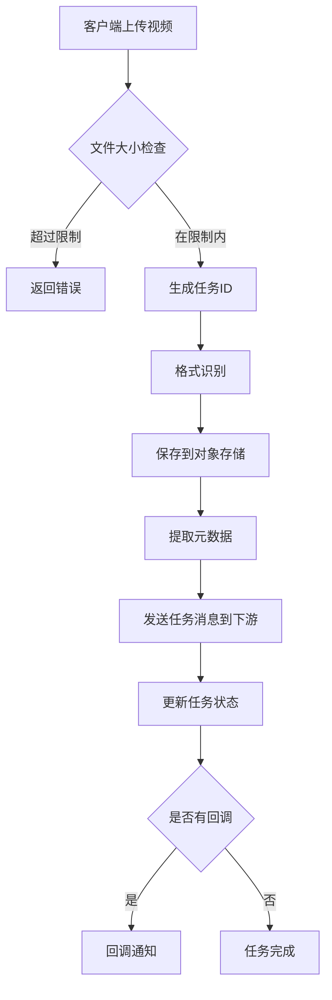
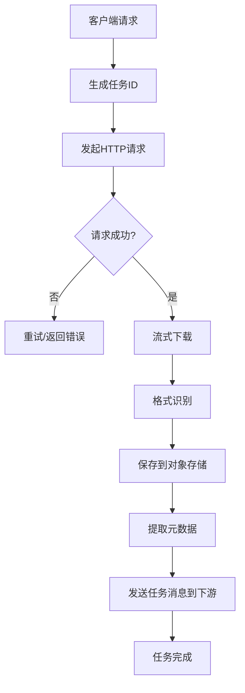
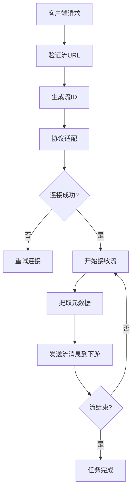

# 输入层设计方案

## 一、设计目标与定位

### 1.1 核心目标
输入层作为视频违规审核系统的入口，负责接收、识别和标准化各种形式的视频输入，为后续的预处理层提供统一格式的原始视频数据。

### 1.2 定位与边界
- **上游依赖**：无（系统入口）
- **下游服务**：预处理层
- **职责边界**：视频接收、格式识别、协议适配、元数据提取、数据暂存

### 1.3 设计原则
- **兼容性**：支持多种视频格式和输入方式
- **高性能**：支持大文件上传和实时流处理
- **可扩展性**：易于添加新的输入类型
- **可靠性**：保证数据完整性和处理稳定性
- **职责单一**：专注于数据接入，不涉及内容解码处理

---

## 二、整体架构设计

### 2.1 架构图

```
┌──────────────────────────────────────────────────────────────────────────┐
│                           输入层架构                                   │
├──────────────────────────────────────────────────────────────────────────┤
│                                                                        │
│  ┌──────────────┐    ┌──────────────┐    ┌──────────────┐             │
│  │   文件上传    │    │   URL抓取     │    │   直播流接入  │             │
│  │  (File Upload)│   │ (URL Fetch)   │   │(Live Stream) │             │
│  └──────┬───────┘    └──────┬───────┘    └──────┬───────┘             │
│         │                   │                   │                      │
│         └─────────┬─────────┴─────────┬─────────┘                      │
│                   ▼                   ▼                                │
│           ┌──────────────┐    ┌──────────────┐                        │
│           │   格式识别    │    │   流协议适配  │                        │
│           │ (Format ID)   │   │ (Protocol    │                        │
│           └──────┬───────┘    │  Adaptation) │                        │
│                  │            └──────┬───────┘                        │
│                  └─────────┬─────────┘                                │
│                            ▼                                          │
│                   ┌──────────────┐                                    │
│                   │  元数据提取   │                                    │
│                   │(Metadata     │                                    │
│                   │ Extraction)  │                                    │
│                   └──────┬───────┘                                    │
│                          │                                            │
│                          ▼                                            │
│                   ┌──────────────┐                                    │
│                   │   数据暂存    │                                    │
│                   │ (Data        │                                    │
│                   │  Staging)    │                                    │
│                   └──────┬───────┘                                    │
│                          │                                            │
│                          ▼                                            │
│                   ┌──────────────┐                                    │
│                   │   输出到下游  │                                    │
│                   │(输出原始字节流)│                                   │
│                   └──────────────┘                                    │
└──────────────────────────────────────────────────────────────────────────┘
```

### 2.2 模块划分

| 模块名称 | 职责描述 | 技术实现 |
|----------|----------|----------|
| **文件上传模块** | 处理本地视频文件上传 | HTTP Multipart / WebSocket |
| **URL抓取模块** | 从远程URL获取视频 | HTTP Client / CDN加速 |
| **直播流接入模块** | 接入实时直播流 | RTMP/HLS/WebRTC协议解析 |
| **格式识别模块** | 识别视频容器格式 | FFprobe / Magic Number |
| **元数据提取模块** | 提取视频元信息（时长、分辨率等） | FFprobe |
| **数据暂存模块** | 临时存储原始视频数据 | MinIO / 本地文件系统 |
| **协议适配模块** | 统一不同输入协议的数据格式 | GStreamer / 自定义适配器 |

---

## 三、技术选型

### 3.1 核心技术栈

| 技术领域 | 技术方案 | 版本 | 选型理由 |
|----------|----------|------|----------|
| **格式识别** | FFprobe | 6.0+ | 轻量级工具，无需解码即可提取元数据 |
| **协议支持** | GStreamer | 1.22+ | 支持多种流媒体协议解析和适配 |
| **Web框架** | FastAPI | 0.100+ | 高性能异步框架，支持文件上传 |
| **消息队列** | Kafka | 3.5+ | 异步处理，支持高吞吐 |
| **对象存储** | MinIO/S3 | - | 大文件存储，支持分片上传 |
| **缓存** | Redis | 7+ | 任务状态管理和缓存 |

### 3.2 支持的输入类型

| 输入类型 | 描述 | 支持格式/协议 |
|----------|------|---------------|
| **视频文件** | 本地文件上传 | MP4, AVI, MOV, FLV, MKV, WebM |
| **视频URL** | 远程视频链接 | HTTP/HTTPS URL |
| **直播流** | 实时直播内容 | RTMP, HLS, WebRTC, HTTP-FLV |
| **视频片段** | 指定时间范围 | 时间戳区间 + 源视频 |

---

## 四、接口设计

### 4.1 接口总览

| API路径 | HTTP方法 | 功能描述 |
|----------|----------|----------|
| `/api/v1/input/video/upload` | POST | 视频文件上传 |
| `/api/v1/input/video/url` | POST | 通过URL获取视频 |
| `/api/v1/input/live/start` | POST | 启动直播流接入 |
| `/api/v1/input/live/stop` | POST | 停止直播流接入 |
| `/api/v1/input/video/segment` | POST | 处理视频片段 |
| `/api/v1/input/tasks/{task_id}` | GET | 查询任务状态 |
| `/api/v1/input/tasks/{task_id}` | DELETE | 取消任务 |
| `/api/v1/input/health` | GET | 健康检查 |

### 4.2 详细接口设计

#### 4.2.1 视频文件上传

**路径**: `POST /api/v1/input/video/upload`

**请求体**:
```json
{
  "video_file": "binary (multipart/form-data)",
  "callback_url": "string (可选，处理完成后的回调地址)",
  "options": {
    "preserve_original": "boolean (是否保留原始文件，默认true)"
  }
}
```

**成功响应**:
```json
{
  "task_id": "string (任务ID)",
  "status": "string (pending/processing)",
  "video_id": "string (视频ID)",
  "metadata": {
    "duration": "number (视频时长，秒)",
    "width": "number (宽度)",
    "height": "number (高度)",
    "fps": "number (帧率)",
    "codec": "string (编码格式)",
    "size": "number (文件大小，字节)",
    "format": "string (容器格式)"
  },
  "storage_path": "string (存储路径)",
  "created_at": "datetime"
}
```

#### 4.2.2 URL视频获取

**路径**: `POST /api/v1/input/video/url`

**请求体**:
```json
{
  "url": "string (视频URL，必填)",
  "callback_url": "string (可选，处理完成后的回调地址)",
  "options": {
    "timeout": "number (请求超时，秒，默认30)",
    "preserve_original": "boolean (是否保留原始文件，默认true)"
  }
}
```

**成功响应**:
```json
{
  "task_id": "string (任务ID)",
  "status": "string (pending/processing)",
  "video_id": "string (视频ID)",
  "metadata": {
    "duration": "number (视频时长，秒)",
    "width": "number (宽度)",
    "height": "number (高度)",
    "fps": "number (帧率)",
    "codec": "string (编码格式)",
    "size": "number (文件大小，字节)",
    "format": "string (容器格式)"
  },
  "storage_path": "string (存储路径)",
  "created_at": "datetime"
}
```

#### 4.2.3 直播流接入

**路径**: `POST /api/v1/input/live/start`

**请求体**:
```json
{
  "stream_url": "string (直播流URL，必填)",
  "protocol": "string (协议类型：rtmp/hls/webrtc/http-flv)",
  "callback_url": "string (可选，流状态变更回调地址)",
  "options": {
    "buffer_size": "number (缓冲区大小，秒，默认10)",
    "reconnect_attempts": "number (重连次数，默认5)",
    "reconnect_delay": "number (重连延迟，秒，默认5)"
  }
}
```

**成功响应**:
```json
{
  "stream_id": "string (流ID)",
  "status": "string (starting/streaming)",
  "stream_url": "string (流URL)",
  "protocol": "string (协议类型)",
  "metadata": {
    "width": "number (宽度)",
    "height": "number (高度)",
    "fps": "number (帧率)",
    "codec": "string (编码格式)"
  },
  "started_at": "datetime"
}
```

#### 4.2.4 视频片段处理

**路径**: `POST /api/v1/input/video/segment`

**请求体**:
```json
{
  "source": "string (视频来源：file/url/video_id)",
  "source_value": "string (来源值)",
  "start_time": "number (开始时间，秒，默认0)",
  "end_time": "number (结束时间，秒)",
  "callback_url": "string (可选，处理完成后的回调地址)"
}
```

**成功响应**:
```json
{
  "task_id": "string (任务ID)",
  "status": "string (pending/processing)",
  "segment_id": "string (片段ID)",
  "metadata": {
    "duration": "number (片段时长，秒)",
    "start_time": "number (开始时间)",
    "end_time": "number (结束时间)",
    "width": "number (宽度)",
    "height": "number (高度)",
    "fps": "number (帧率)"
  },
  "storage_path": "string (存储路径)",
  "created_at": "datetime"
}
```

#### 4.2.5 查询任务状态

**路径**: `GET /api/v1/input/tasks/{task_id}`

**成功响应**:
```json
{
  "task_id": "string (任务ID)",
  "status": "string (pending/processing/completed/failed)",
  "video_id": "string (视频ID)",
  "progress": "number (进度，0-100)",
  "metadata": {},
  "error": "string (错误信息，失败时返回)",
  "created_at": "datetime",
  "updated_at": "datetime"
}
```

---

## 五、出入参设计

### 5.1 输入参数汇总

| 参数名 | 类型 | 描述 | 约束 | 默认值 |
|--------|------|------|------|--------|
| **video_file** | binary | 视频文件 | multipart/form-data | - |
| **url** | string | 视频URL | 有效URL格式 | - |
| **stream_url** | string | 直播流URL | 有效URL格式 | - |
| **protocol** | string | 协议类型 | rtmp/hls/webrtc/http-flv | - |
| **source** | string | 来源类型 | file/url/video_id | - |
| **source_value** | string | 来源值 | - | - |
| **start_time** | number | 开始时间 | ≥0 | 0 |
| **end_time** | number | 结束时间 | >start_time | 视频时长 |
| **callback_url** | string | 回调URL | 有效URL格式 | null |
| **timeout** | number | 请求超时 | >0 | 30 |
| **buffer_size** | number | 缓冲区大小 | >0 | 10 |
| **reconnect_attempts** | number | 重连次数 | ≥0 | 5 |
| **reconnect_delay** | number | 重连延迟 | >0 | 5 |
| **preserve_original** | boolean | 是否保留原始文件 | - | true |

### 5.2 输出参数汇总

#### 5.2.1 任务响应结构

| 参数名 | 类型 | 描述 |
|--------|------|------|
| **task_id** | string | 任务唯一标识 |
| **stream_id** | string | 流唯一标识 |
| **video_id** | string | 视频唯一标识 |
| **segment_id** | string | 片段唯一标识 |
| **status** | string | 状态 |
| **progress** | number | 进度(0-100) |
| **metadata** | object | 视频元数据 |
| **storage_path** | string | 文件存储路径 |
| **error** | string | 错误信息 |
| **created_at** | datetime | 创建时间 |
| **updated_at** | datetime | 更新时间 |

#### 5.2.2 元数据结构

| 参数名 | 类型 | 描述 |
|--------|------|------|
| **duration** | number | 视频时长(秒) |
| **width** | number | 视频宽度(像素) |
| **height** | number | 视频高度(像素) |
| **fps** | number | 帧率(帧/秒) |
| **codec** | string | 编码格式 |
| **format** | string | 容器格式 |
| **size** | number | 文件大小(字节) |
| **start_time** | number | 片段开始时间 |
| **end_time** | number | 片段结束时间 |

#### 5.2.3 标准化输出结构（向下游输出）

```json
{
  "video_id": "string (视频唯一标识)",
  "source_type": "string (来源类型：file/url/live/segment)",
  "metadata": {
    "duration": "number (视频时长，秒)",
    "width": "number (宽度，像素)",
    "height": "number (高度，像素)",
    "fps": "number (帧率)",
    "codec": "string (编码格式)",
    "format": "string (容器格式)",
    "size": "number (文件大小，字节)"
  },
  "storage_path": "string (文件存储路径)",
  "created_at": "datetime",
  "processed_at": "datetime"
}
```

---

## 六、业务流程

### 6.1 文件上传流程



### 6.2 URL视频获取流程



### 6.3 直播流接入流程



---

## 七、关键设计要点

### 7.1 文件大小限制

| 输入类型 | 最大大小 | 处理策略 |
|----------|----------|----------|
| **视频文件** | 5GB | 分片上传、断点续传 |
| **视频URL** | 无限制 | 流式处理 |
| **直播流** | 无限制 | 实时流式处理 |

### 7.2 格式识别策略

| 识别方式 | 适用场景 | 技术实现 |
|----------|----------|----------|
| **Magic Number** | 快速识别文件格式 | 读取文件头字节 |
| **FFprobe** | 提取详细元数据 | 轻量级工具，无需解码 |
| **扩展名校验** | 辅助验证 | 文件扩展名匹配 |

### 7.3 错误处理

| 错误类型 | 处理策略 | 重试机制 |
|----------|----------|----------|
| **格式不支持** | 返回错误码 | 不重试 |
| **文件损坏** | 返回错误码 | 不重试 |
| **网络超时** | 返回错误码 | 可配置重试 |
| **存储失败** | 回滚操作 | 可配置重试 |
| **协议不支持** | 返回错误码 | 不重试 |

### 7.4 性能优化

| 策略 | 描述 | 实施方式 |
|------|------|----------|
| **异步处理** | 大文件异步处理 | Kafka消息队列 |
| **分片上传** | 支持大文件分片 | HTTP分块上传 |
| **流式处理** | 边下载边存储 | 流式写入对象存储 |
| **缓存机制** | 缓存任务状态 | Redis缓存 |
| **格式预识别** | 提前识别格式 | Magic Number快速检测 |

### 7.5 安全性

| 策略 | 描述 | 实施方式 |
|------|------|----------|
| **文件类型校验** | 校验文件真实类型 | Magic Number检测 |
| **恶意文件检测** | 检测潜在恶意内容 | 病毒扫描 |
| **访问控制** | 限制上传权限 | API Key + Token |
| **请求限速** | 限制上传频率 | 速率限制器 |

---

## 八、部署架构

### 8.1 物理架构

```
┌─────────────────────────────────────────────────────────────────┐
│                        输入层部署架构                           │
├─────────────────────────────────────────────────────────────────┤
│                                                               │
│  ┌─────────────────────────────────────────────────────────┐   │
│  │                    前端接入层                            │   │
│  │  ┌──────────┐ ┌──────────┐ ┌──────────┐               │   │
│  │  │  Nginx   │ │  CDN     │ │  WAF     │               │   │
│  │  │(负载均衡) │ │(静态加速)│ │(安全防护)│               │   │
│  │  └──────────┘ └──────────┘ └──────────┘               │   │
│  └────────────────────┬────────────────────────────────────┘   │
│                       │                                        │
│                       ▼                                        │
│  ┌─────────────────────────────────────────────────────────┐   │
│  │                    应用服务层                            │   │
│  │  ┌──────────┐ ┌──────────┐ ┌──────────┐               │   │
│  │  │ Upload   │ │ URL      │ │ Live     │               │   │
│  │  │ Service  │ │ Fetch    │ │ Stream   │               │   │
│  │  │ (Pod×3)  │ │ Service  │ │ Service  │               │   │
│  │  │          │ │ (Pod×3)  │ │ (Pod×3)  │               │   │
│  │  └──────────┘ └──────────┘ └──────────┘               │   │
│  └────────────────────┬────────────────────────────────────┘   │
│                       │                                        │
│                       ▼                                        │
│  ┌─────────────────────────────────────────────────────────┐   │
│  │                    存储层                                │   │
│  │  ┌──────────┐ ┌──────────┐ ┌──────────┐               │   │
│  │  │ MinIO    │ │ Redis    │ │ Kafka    │               │   │
│  │  │(对象存储) │ │(缓存)    │ │(消息队列)│               │   │
│  │  └──────────┘ └──────────┘ └──────────┘               │   │
│  └─────────────────────────────────────────────────────────┘   │
│                                                               │
└─────────────────────────────────────────────────────────────────┘
```

---

## 九、总结

输入层作为视频违规审核系统的入口，通过多种输入方式（文件上传、URL抓取、直播流接入）接收视频数据，经过格式识别、元数据提取和数据暂存等处理步骤，最终输出标准化的原始视频数据供下游预处理层使用。

**核心设计要点**：
- **职责单一**：专注于数据接入，不涉及内容解码处理
- **兼容性**：支持多种视频格式和协议
- **高性能**：异步处理、流式处理、分片上传
- **可靠性**：完善的错误处理和重试机制
- **安全性**：文件校验、访问控制、请求限速

**与预处理层的职责划分**：
- **输入层**：负责视频数据的接收、格式识别、元数据提取和数据暂存
- **预处理层**：负责视频解码、帧采样、音频提取等内容处理